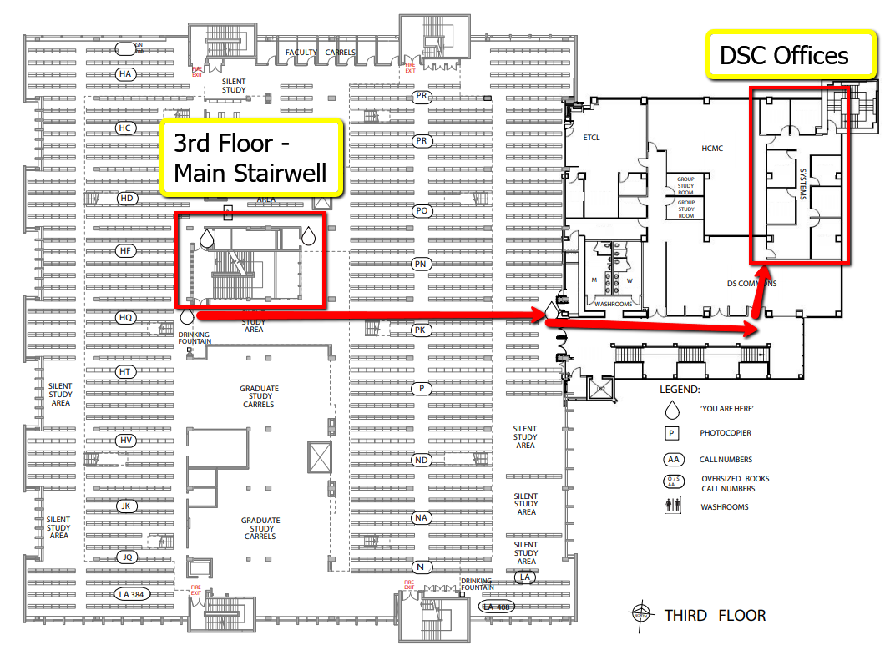
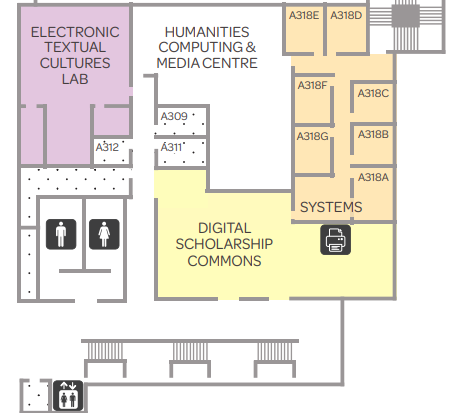
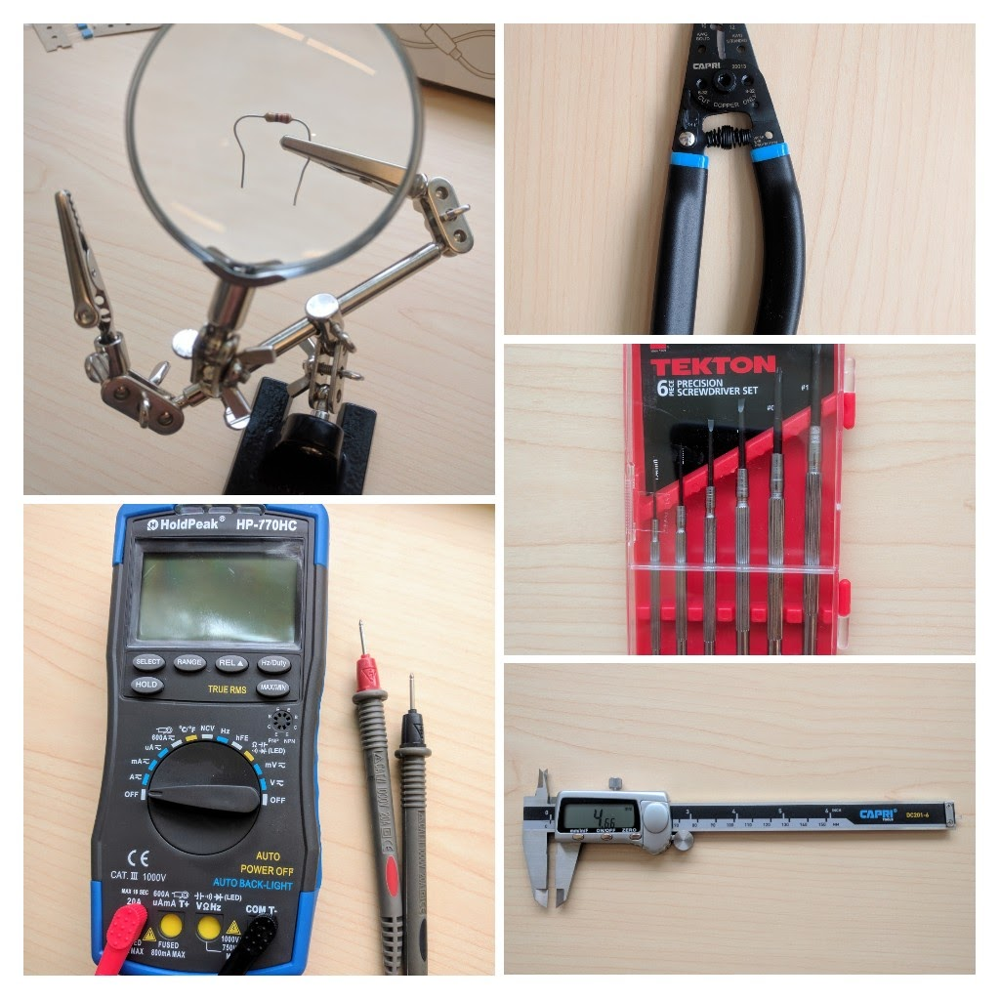

# DSC Front Desk Duties
The DSC Desk is the first point of contact for students, staff, faculty and community members entering the DSC space.  When working at the desk, your main duties are to direct traffic and answer questions.

1. If you are **first at the desk** for the day:
    - sign out DSC storage room key from the library front desk (1st floor)
    - get the DSC desk key from the office cabinet
    - plug in the telephone
    - put away the closed sign

2. If you are **last** to leave:
    - put away the phone and lock the desk drawer
    - put away the key in the office cabinet 
    - Return DSC storage room key to the front desk if you've checked it out
    - if the waste bin is full dispose of it in the larger bins by the metal DSC signage.  Janitorial staff usually miss the DSC desk bin when they do their rounds, so please do this regularly.
    - put up the closed sign. 
    
   

3. Answering questions at the desk:  
    - Directions and printing questions are most common.  Make sure you're familiar with major library locations ([https://www.uvic.ca/library/use/floormaps/index.php](https://www.uvic.ca/library/use/floormaps/index.php){:target="_blank"}) and the DSC website [FAQ](https://onlineacademiccommunity.uvic.ca/dsc/faq/){:target="_blank"}
    - Track your interactions here: [https://docs.google.com/forms/d/e/1FAIpQLScFA_hQrWr-IlVN0zp_ha9dMO6IJOV1Qsxdu5sQdpiQMRnzLg/viewform](https://docs.google.com/forms/d/e/1FAIpQLScFA_hQrWr-IlVN0zp_ha9dMO6IJOV1Qsxdu5sQdpiQMRnzLg/viewform){:target="_blank"}  
        - This helps DSC managers know who is busy and the needs of library users
        - If the Audience type is unknown, you can leave it blank
        - Time spent can be a rough best estimate

4. Paper Printing:
    - Instructions for student printing at the library are located above the DSC printers (QR code)
        - Note that our black and white printer is named differently than the rest of the BW printers in the library. *Our printer is named "LIBRBW-R on papercutprint.*
    - **Large Format Printing** is different from normal library print jobs and goes through the web app.  Instructions are found here: [Google Drive instructions](https://docs.google.com/document/d/1rSmanPw3Syy8qlTgIyckcR5QKKcHGdS-/edit){:target="_blank"}

5. Managing the DSC Space and Tools:
    - Students are allowed to talk in the DSC area, although the rest of the 3rd floor is silent space.  If volume gets too loud, you can politely remind them that sound travels easily to other areas of the library.
    - The red carpeted corridor leading from the doors next to the DSC desk to the back offices **must be clear at all times**.  It is a fire corridor and cannot be blocked. 
    - Students and faculty can use the special software (Adobe suite, FineReader, and Scanning) computers first-come-first-serve.  
    - Special equipment (digital calipers, hand tools, etc) can be borrowed and used **while in the DSC space**.  Small electronics parts (resistors, sensors, wires etc) are loaned out on the honor system and should be returned as soon as the student is finished using them.  **Raspberry Pi kits and recording equipment** are loaned out from the main library desk. If students need tools such as digital calipers and multimeters, some of those are available for borrowing at the main library desk on the first floor as well.

    

6. Additional Projects and Tasks
    - DSC projects and tasks are managed in Teams in the DSC team DSC Projects task planner. Make sure you have Teams running on your computer when you log in, as this is a primary source of quick communication. Many of us have this installed as an app on our phones so we can contact each other across campus, but this is optional. 
    - You can work on tasks assigned to you, or assign yourself a task from the **Unassigned Projects** column. 
    - Once you have finished a task, move the task card to **Ready for Review**.  Rich will move the card to Completed Projects after reviewing.
   

    [NEXT STEP: Events and Workshops](2-Events and Workshops.html){: .btn .btn-blue }
