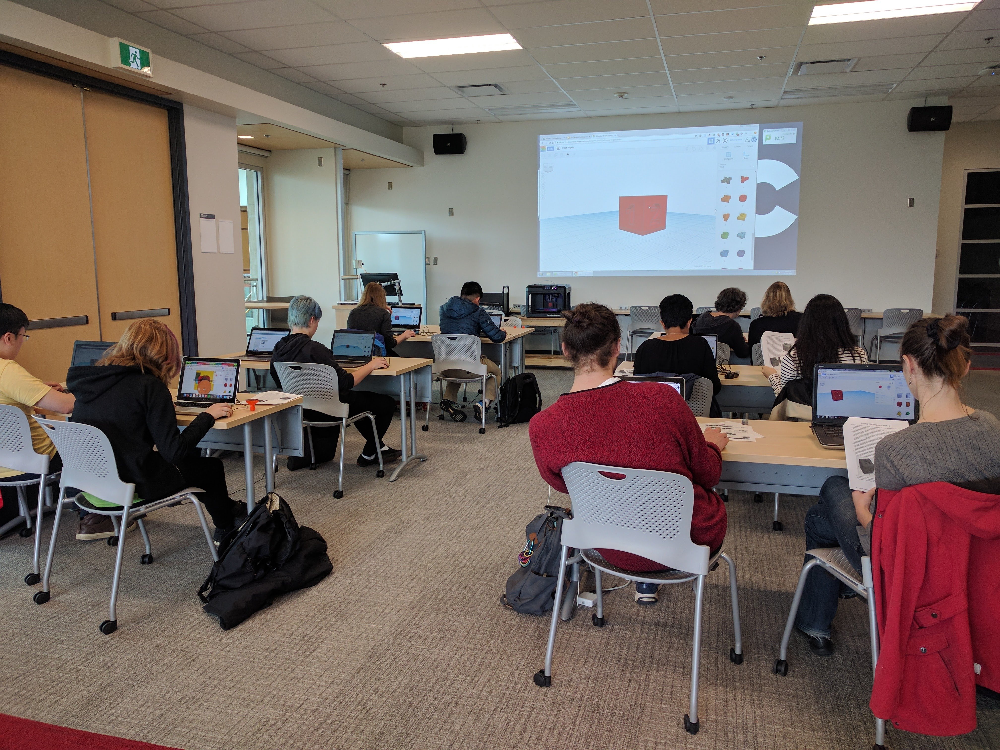

# DSC Events

1. The DSC room booking schedule is here: [https://staff.library.uvic.ca/dscommons/] (https://staff.library.uvic.ca/dscommons/) {:target="_blank"}
    - There should also be a paper copy of the week's events posted at both DSC entrances, the template is here: [https://docs.google.com/presentation/d/1pcXJKexWYgPVvqX0vPmUwvSdr3dsn3UYctJPX_Ri0tI/edit#slide=id.p](https://docs.google.com/presentation/d/1pcXJKexWYgPVvqX0vPmUwvSdr3dsn3UYctJPX_Ri0tI/edit#slide=id.p){:target="_blank"}

    

2. If there is a scheduled workshop or event, place **Reserved** signs on the front tables (or all tables if the whole room is reserved) about 1 hour ahead of the scheduled start time.  The overhead projector should show the event and reserved time for the day.
    - 'Reserved' signs are stored in the second drawer of the DSC assistant desk.
    - A detailed guide to setting up the AV cabinet for hybrid workshops is here (depending on your role you may or may not be responsible for setup): [https://docs.google.com/document/d/1yevYatroOnBSGE5fmOH2rbSlWUzxJsPy/edit#heading=h.gjdgxs](https://docs.google.com/document/d/1yevYatroOnBSGE5fmOH2rbSlWUzxJsPy/edit#heading=h.gjdgxs){:target="_blank"}
        - you can also find a paper copy of this inside the AV cabinet.
        - if you need specialized software, you will need to connect the podium laptop (see Dani or Rich about access and set up of that laptop)

3. The red carpeted corridor leading from the doors next to the DSC desk to the back offices **must be open and clear at all times**.  It is a fire corridor and cannot be blocked or obstructed.
    
4. After an event, the organizers are responsible for returning tables & chairs to their **original configuration** unless they have booked someone to reset the room for them. (Occasionally, this will be neglected and we will need to reset the room.)  A guide to the default table setup is taped on the wall next to the AV cabinet.

[NEXT STEP: 3D Printing](3-3D Printing.html){: .btn .btn-blue }
