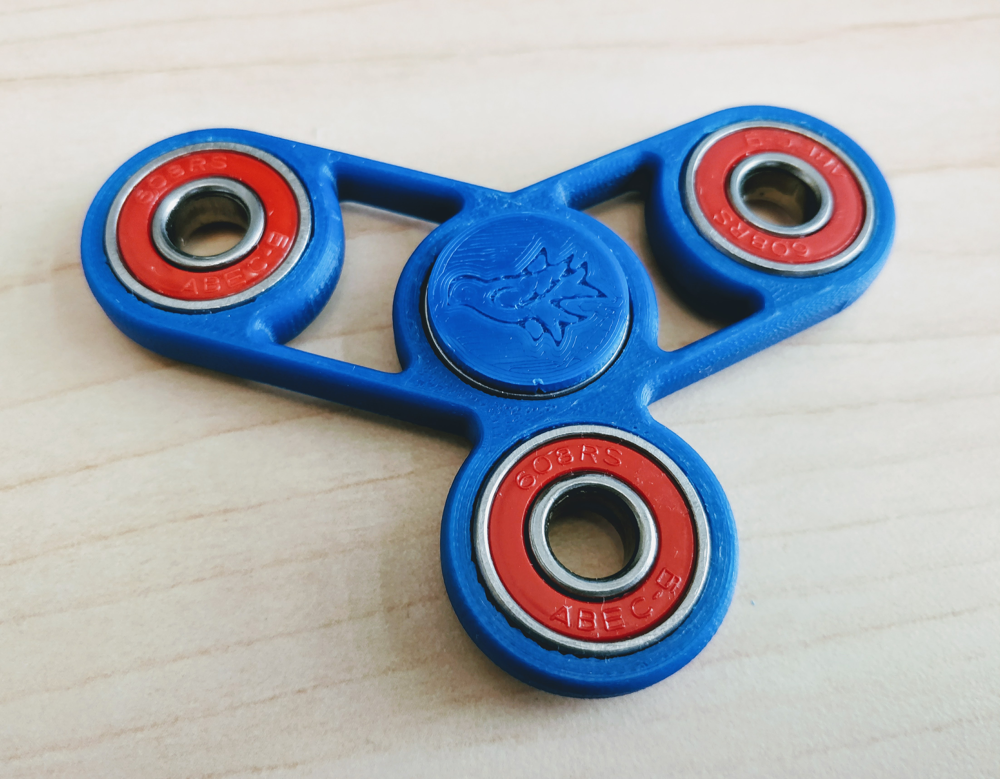

# 3D Printing

1. Please review the following [Workshop on 3D printing](https://uviclibraries.github.io/3d-design-print/){:target="_blank"} 

2. Read the Staff Printing guide here: [https://docs.google.com/document/d/1WWErUqDHkZ28AamaiD-OEPgqqcGV4j3bq1SJS6cPkXA/edit#heading=h.qr0lyvmiwu70](https://docs.google.com/document/d/1WWErUqDHkZ28AamaiD-OEPgqqcGV4j3bq1SJS6cPkXA/edit#heading=h.qr0lyvmiwu70){:target="_blank"} 

3. Read the pamphlets on 3D printing at the DSC desk.

4. Browse some 3D prints on [thingiverse](https://www.thingiverse.com/){:target="_blank"}  and [printables](https://www.printables.com/model){:target="_blank"}.  Get familiar with the wide array of items and download one or two items you find interesting.

5. Make sure you are able to open and navigate **Cura** on the DSC computer and that both **Claudia** and **Brunel** are connected. Open the files you downloaded and spend some time moving them around, changing the scale, and changing the print settings.
    - If you need help using Ultimaker Cura, the official support page is here: [https://support.makerbot.com/s/topic/0TO5b000000Q4wVGAS/using-ultimaker-cura](https://support.makerbot.com/s/topic/0TO5b000000Q4wVGAS/using-ultimaker-cura){:target="_blank"} 
    - Google is also a great tool!

6. Optional: open and get familiar with **MakerBot** software. The Makerbot printer is older and lower quality so it is generally only used at high volume times.

7. Optional: Set automatic material pricing: 
    - Go to Settings > Extruder 1 > Material > Manage Materials OR hit control+K on your keyboard.
    - On the left side select General, then change the Currency to $ (if it is not already set to dollars)
    - Select Materials, the Generic PLA.  Enter the Filament Cost as 0.1, and the Filament Weight as 1 g.
    - Select Generic PVA.  Enter Filament Cost as 0.2g, and Filament Weight as 1g.
    - Select Generic TPU.  Enter Filament Cost as 0.2g, and Filament Weight as 1g.
    - Repeat these steps for PVA (Ultimaker Natural), TPU95A (Ultimaker White and Black) and the Ultimaker brand PLA colors if desired (we usually don't have any in stock so this is optional)
    - Close the window when finished.  Now Cura will tell you the cost of prints automatically!
        

8. Hands-on training: 
    - practise sending a file to 3D print
    - practise changing the filament in the printers
    - practise removing a completed print from the printbed
    - practise swapping out the glass printbed
    - practise labeling and dropping off a completed print
    - optional: practise removing supports from a print
    - optional: practise Hot & Cold pulls

[NEXT STEP: Navigating the Web App](4-Web App.html){: .btn .btn-blue }