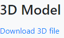

# Web App

3D Printing and Laser Cutting requests are submitted via the DSC Web App: [https://webapp.library.uvic.ca/3dprint/customer-dashboard.php](https://webapp.library.uvic.ca/3dprint/customer-dashboard.php).  Open the link and follow the instructions below to get familiar with how to use the app.

1. If you don't already have an account, create one using your netlink ID.

2. Click 'Create New Print Job' and  read through the submission form.

3. After you are given admin access, you will be able to see the Dashboard by clicking the **Admin Dashboard** button.      
    - **Personal Dashboard:** takes you back to the main landing page.
    - **Reports:** shows payment records
    - **Print History:** shows recent activity (not used often)
    - **Manage Printers:** old function, no longer used
    - **Manage Users:** lets you search user contact information

4. The main admin dashboard sorts each job by status: submitted, payment pending, paid, printing, completed, and archived.  Click on a submitted job to see more information.

5. When a job is submitted, open it and download the file.  Open the file in Cura, then check all of the requested settings. 
    - The settings that most often are missed when pricing are the **Number of Copies** and **Scale**, special settings in the **comments box** like colour, sizing, etc.
    - Change settings as needed in Cura, then **Slice** to calculate the price.  PLA and PETG are **$0.10/gram**, PVA and TPU95 are **$0.20/gram**.
    - Enter the price in the web app **(on the parent file)** and the duration in minutes, set Status to Pending Payment, and click **Save**.
  
6. Academic jobs are identified by users upon submission of a job. For these jobs, users can identify a deadline for their project. 
    - The course code and submission deadlines can be seen on the job information page.
    - In the dashboard, "purpose" is identified as academic or personal (with academic jobs being at the top of the list). Academic jobs are prioritized over personal jobs to meet as many timelines as possible. 

8. If a user submits **multiple files** at the same time, price all items together (unless they request otherwise). 
    - Items need to be financially linked. To do this, select one item and mark the other models that are being priced together as **children**.
    - You can change the status of multiple linked jobs, or multiple active jobs, for the same user simultaneously by checking the **"Update statuses to match"** box.
    - By updating statuses to match, we can avoid forgetting to move one model in the queue, reducing the chances of errors. 
        - Note that you cannot update statuses to match and abandon a job as a child simultaneously.
    - When jobs have been set as parent and child(ren), the user will only be able to pay for the set as a whole, if they try to pay from the job page of a child, they will see a message similar to this one.  **Make sure to put the price of the whole project in the Parent job. If the price is put in one of the child jobs, this will create a problem for the person attempting to pay since it is not possible to pay from a child job.**
    - If updating statuses individually (rare), when we save a job as 'pending payment' or 'delivered', an email is automatically sent to the user.  Since we don't want to send multiple emails for a bundle of prints, make sure to **uncheck Enable Email** at the bottom of the page for every print **other than the one you've priced**.
  
9. If a user needs to be emailed for clarification or any other purposes, please change the job status to **On Hold and put a note in the the job so that other admin staff know why that job is On Hold**.
   - Depending on your role, you may be the one to email users about their print jobs.
   - By being at the "On hold" status, all staff members can know that communication is happening between staff and the user, avoiding prematurely pricing a faulty model.
   - Jobs should only be taken out of the "On Hold" status by staff members who are communicating specifically with a user about their project.

10. The DSC has a loose policy on personal projects since our primary objective is to assist with academic endeavors. Once a student has exceeded the limit of hours of personal projects allowed, a red message will appear for every job by this user.
    - When the queue is quiet, DSC staff can choose to allow students to go over this limit at their discretion, as the policy was introduced to avoid delaying academic projects during busy periods.
    - As needed, the DSC can also prohibit personal projects completely for a given time as needed to catch up on the queue. If such a decision is taken, you will be informed by a supervisor. 

11. **Staff Notes** box: 
    - this box is for communications between staff members and can only be seen by **Admin** users.  Make notes in this box if there are problems with the print, you're emailed a user, or any other special notes about a specific print.
    - example: 'emailed user about their special requests, do not price yet - Feb 8, Victoria'
    - example: 'multiple files, priced for all 4 items'
    - example: 'no charge for print, see email correspondence'

[NEXT STEP: Laser Cutting](5-Laser Cutting.html){: .btn .btn-blue }
