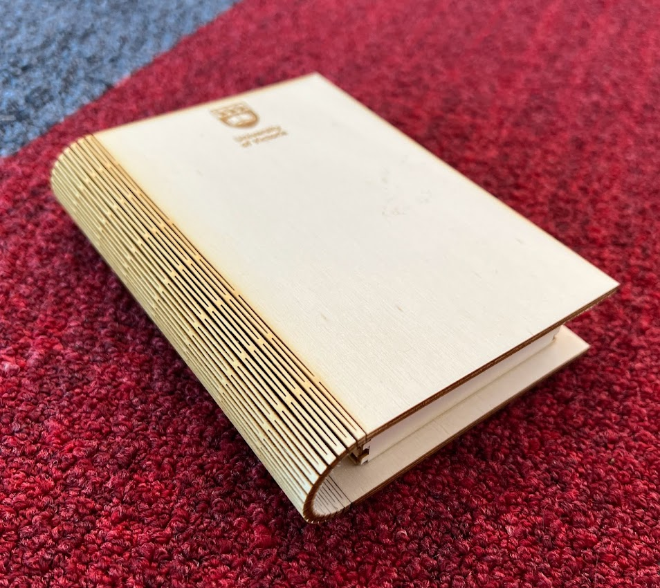

# Laser Cutting

The laser cutter is the DSC's newest piece of equipment.  It can cut or engrave wood, paper, cardboard, and more.  Currently, only full time staff can operate the laser cutter alone.

1. Read the laser cutting FAQ: [https://onlineacademiccommunity.uvic.ca/dsc/how-to-laser-cut/](https://onlineacademiccommunity.uvic.ca/dsc/how-to-laser-cut/)

    

2. Read the Laser Cutting Staff Guide: [https://docs.google.com/document/d/1AjjRaYBW3XyI8Syf6feJVh-oIfTr6Jt0sXyDN-XdJWE/edit](https://docs.google.com/document/d/1AjjRaYBW3XyI8Syf6feJVh-oIfTr6Jt0sXyDN-XdJWE/edit)

3. Go through the laser cutting workshop: [lib.uvic.ca/lasdes](https://uviclibraries.github.io/laser/)

4. Depending on your position, gain hands-on training to use the laser cutter safely.  _Note: Do not operate the laser cutter alone before getting approval from your supervisor._
    - practise turning the laser cutter and filter on and off
    - practise calibrating the bed height
    - practise uploading a new svg file into Trotec Ruby
    - practise editing, double checking laser position, and starting laser cut jobs in Trotec Ruby
    - learn about fire protocols and laser safety (i.e don't look directly at the laser beam)
    - optional: take the Uvic laser safety training course: [https://www.uvic.ca/ohse/training/research-safety/laser-safety/index.php](https://www.uvic.ca/ohse/training/research-safety/laser-safety/index.php)

[NEXT STEP: Additional Resources](additional-resources.html){: .btn .btn-blue }