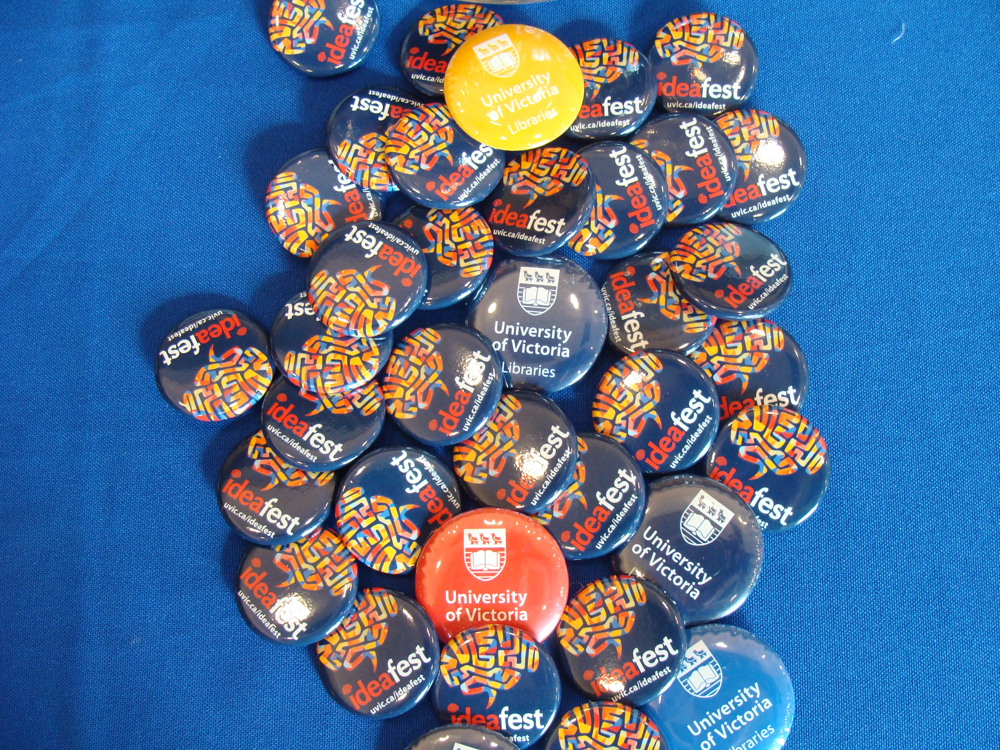

# DSC Workshops

- Workshops need to be reviewed frequently. Software interfaces may change, or maybe you have a great idea for a new activity.  Depending on your role you may or may not directly edit workshop content, and everyone can contribute to keeping workshop content up to date.
  
- Workshop content can be accessed from the DSC lesson plans page: [https://onlineacademiccommunity.uvic.ca/dsc/workshops/lessonplans/](https://onlineacademiccommunity.uvic.ca/dsc/workshops/lessonplans/){:target="_blank"}

- The Hypothesis chrome plugin lets you add comments directly to web pages: [https://chrome.google.com/webstore/detail/hypothesis-web-pdf-annota/bjfhmglciegochdpefhhlphglcehbmek](https://chrome.google.com/webstore/detail/hypothesis-web-pdf-annota/bjfhmglciegochdpefhhlphglcehbmek){:target="_blank"}
  
- Instructions on using Hypothesis can be found here: [https://trello.com/c/IaTlWcuK/485-use-hypothesis-for-reviewing-workshops](https://trello.com/c/IaTlWcuK/485-use-hypothesis-for-reviewing-workshops){:target="_blank"}
  
- If you have edit access to one or more workshops, they are hosted on GitHub here: [https://github.com/uviclibraries](https://github.com/uviclibraries){:target="_blank"}
