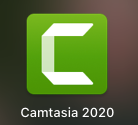
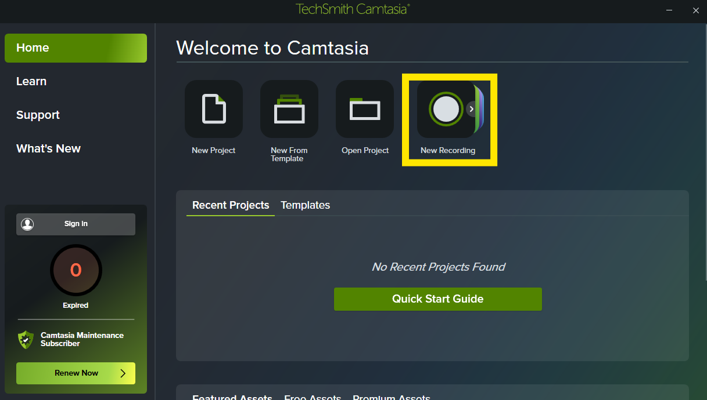
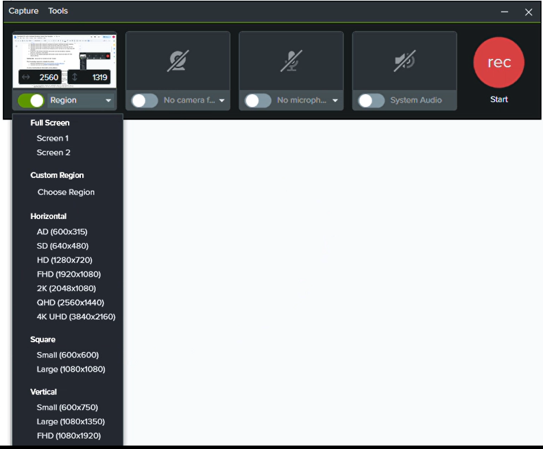
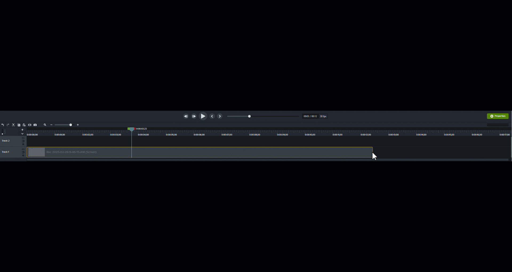
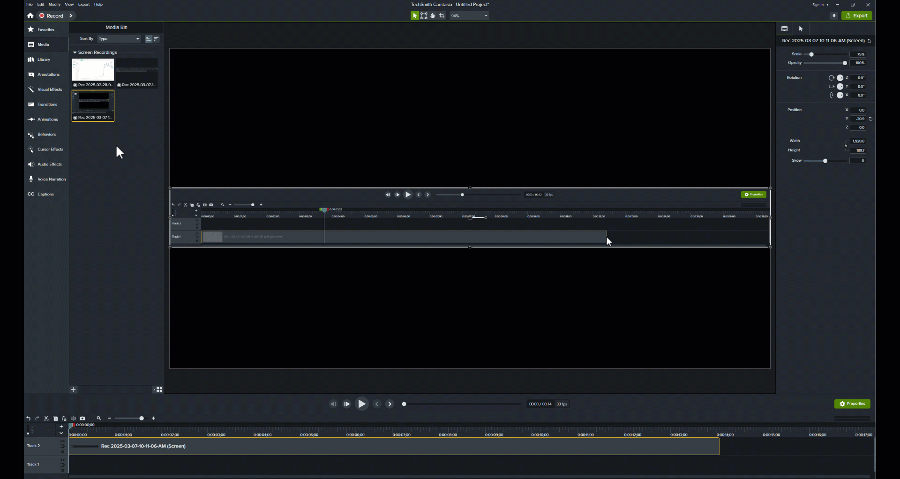

# Animated Gifs with Camtasia

### Learning outcomes:
- Participants will be able to know and do the following by the end of this workshop:
- Participants will be able to identify key elements that support multimedia principles of learning
- Participants will be able to identify key tools that will help create clear concise GIFs
- Participants will be able to understand the importance of time and how to start and end GIFs
- Participants will be able to download and transpose the GIFs into files such as Google Docs and Webpages.
- By the end of the workshop participants will be able to add new annotations, transitions, behaviours, animations, cursor effects. By the end of the workshop participants will be able to screen record and create a GIF that supports learning 

## Introduction to Camtasia and GIF Creation 
**Prior Knowledge required to complete the activity:**
1. [Download Camtasia free trial](https://www.techsmith.com/video-editor.html){:target="_blank"} or if you are using the main desktop computer, then Camtasia is already downloaded.
2. Understand and know the importance of Multimedia principles such as the [signaling principle](https://www.youtube.com/watch?time_continue=1&v=Xr1kOIFVD9E&feature=emb_logo){:target="_blank"}

## In-Lesson Activity Steps & Associated Learning Objects:
**1. Record a video using Camtasia**
  - First, open the program with the software you want to demonstrate how to use
  - Next on Camtasia, click **New Recording**
  - You can now select the region you wish to record in order to adjust it according to what you would like, click on the two arrows near the area it says the size (number X number) and select **Choose Region**
  - If you would like to add a video of yourself, tick on the Facetime option, if you would like to add built in or system audio (same thing), but for the purpose of this workshop we will only select the **screen record option** as an animated GIF has no sound.
  - Finally click **Start Recording**
  - Camtasia will count down from three seconds before it starts recording.
  - Do your demonstration showing your explanation using your cursor and then press the **Stop Recording** button at the top of the screen (in the screen bar) when you are done. (Please note: try to limit your recording to approximately 30 seconds)
  - The video will automatically transfer to Camtasia in order to move onto editing

View and Play the Recording by pressing the play button below the video. (Note: pressing the spacebar will start and stop the video which is very handy while editing)

**3. Editing a recording using Camtasia**
 - Trim the start and end of the video by selecting the video in the timeline and then moving the mouse pointer over the end of the video clip and then drag the handle to the left. The same can be done with the beginning of the video if you’d like.
 - If you would like to cut parts inside the video, move your cursor in the timeline to the starting location you wish to trim, and drag the red toggle to the end of the location. This will highlight and in a blue the desired location you wish to cut.
 - Next click on **the scissors** to cut the highlighted part of the video
 - If you do not like the change, select the **backwards arrow** or **command Z**
Note: Aim for your recording and final edits to be less than 25 seconds

    <button onclick="toggle('gif1')">Show/Hide Animation</button>
    

    
    

    
**4. Adding Transitions**
- Select the transitions tab 
- Next select **Circle Reveal** and drag it to the beginning of your video in the timeline below.
- Next select **Fade** and drag it to the end of your video in the timeline below.
- Now modify the length of these transitions by moving your cursor to the edge and dragging the handle to make it last longer or shorter.

    <button onclick="toggle('gif2')">Show/Hide Animation</button>
    

    
    

   
**5. Adjusting view and adding Animations** 
- Select the video in the timeline
- On the right hand side, select the **visual properties** icon
- To zoom in or out adjust the scale (if you zoom out, note that the black around the image will be viewed like that). 
- Drag the image by clicking and dragging to the section of the image that you would like to zoom in on. This will be the view for the whole recording
- Now if you only want to zoom in on one specific section, go to the animation tab and select **Scale up** and drag to the section (you wish to zoom in) in the video timeline
- Adjust the animation by clicking on the arrow and repeating step b-d (note that you have to adjust the whole animation as it is moving in, therefore the view may be slightly different throughout the animation)
- After you **scale up** you can **scale to fit** which will bring you back to the original view of the video.
- You can also **scale down** if you only want to be able to see part of the recording still.
- Finally, you can modify the animation length by clicking on the white edge of the arrow and dragging it longer or shorter. 

**6. Scale curser/ Adding Cursor Effects**
- To adjust cursor of the whole video, go to the right hand side of the screen and select **cursor properties**
- Next modify the scale, scale the cursor to “**0%**” as we will add in cursor effects next
- Select **cursor effects** on the left hand side of the screen
- Click and drag the **magnify**  to the video timeline
- Now adjust the length by moving in the edges (similar to step 3a). Adjust the end of the video cursor to end 1-2 seconds before the end of the video
- Select the cursor magnify element in the bottom of the video timeline
- Now modify some of the parameters according to what works for your video (you can adjust the size of the curser, shadow, softness, zoom and the ease in/ out).
- There will already be an ease out, the 1 second is usually perfect to end the video

**7. Adding Annotations**
- Select the annotation tab
- Here you can add callouts, arrows and lines, shapes, blur and highlights, sketch motions and keystroke callout.
- In this workshop we will highlight an important element in our video.
- Select the “Blur and highlight” element.
- Drag the yellow highlight to right above the video timeline (in track 2).
- Move the highlight to where you would like it in the video and adjust the length of time
- To move the highlight to the word or object you would like, move the yellow highlight where you view the video
- On the right hand side you can adjust the colour and opacity that works for you.

**Paid version Steps**
**8. Save and Exporting to create animated GIF (only available in paid version)**
- Go to **File** and **Save as**. This will save your file as a camtasia file so that you can go back and modify or adjust later.
- Next to export it and create an animated GIF, select **Export** (green icon at the top right)
- Click **Local file**
- File format **Animated GIF** (.gif)” and “**export**”
- If the file is too large to add to Github, repeat the previous steps but in step d, select options and change dimensions of GIF to 50%

**9. Adding to Google Docs (only available in paid version)**
- Select **insert** and from the toggle click **image**
- Upload from computer by selecting **desktop** and **open**
Adjust the spacing by clicking on the GIF that is now Google Docs, click on **wrap text** and change the margin to **O%**

