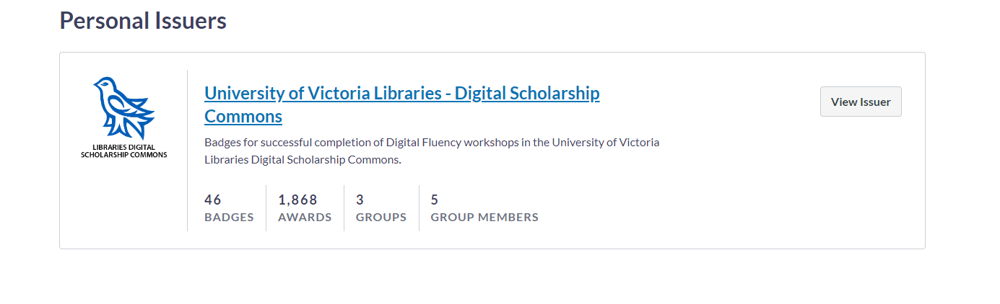
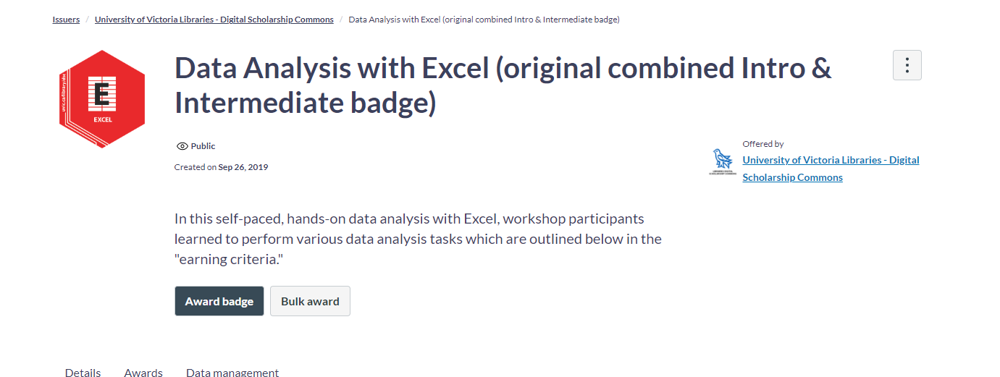
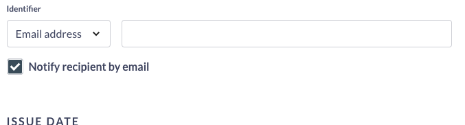

# How to award digital badges using the DSC Badgr Account
1. First create an account using [Badgr US](https://badgr.com/auth/login){:target="_blank"}  and make sure to log in to your account in order to accept the invitation.
2. You will receive an invitation from Canvas Credentials saying “_you have been invited to be an editor for the University of Victoria Libraries -Digital Scholarship Commons_". View and Accept the invitation.
3. Once you have accepted the invitation and see the DSC as a personal issuer

4. Click on the **View issuer**, this will show the list of badges that we currently offer.
5. Next, select the badge you wish to issue.
6. Click the **Award badge** button.
   
7. Copy and paste the email address of the badge earner in the identifier email address. Then press the **Award badge** button.
   
8. Once you have awarded the badge to the workshop participant send this message to the email address provided (copy and paste the message below).

```
Great job!  Your digital badge is on its way to you. Here are instructions on how to add your badge to your LinkedIn certifications: https://lib.uvic.ca/badges

If you would like to check out some of our other DSC workshops, you can see what we have coming up here: https://lib.uvic.ca/curric

Lastly, we'd love to get your feedback on what aspect of the workshop was most helpful to you, and what we might do to improve it: https://lib.uvic.ca/eval

Cheers, _______________

P.S. Never forget learning is not a spectator sport!
```
  <button onclick="toggle('gif1')">Show / Hide Animation </button>
<div id="gif1">
      
      </div>

 <script>  

    function toggle(input) {
        var x = document.getElementById(input);
        if (x.style.display === "none") {
            x.style.display = "block";
        } else {
            x.style.display = "none";
        }
    }
</script>

[NEXT STEP: Additional Resources](additional-resources.html){: .btn .btn-blue }
