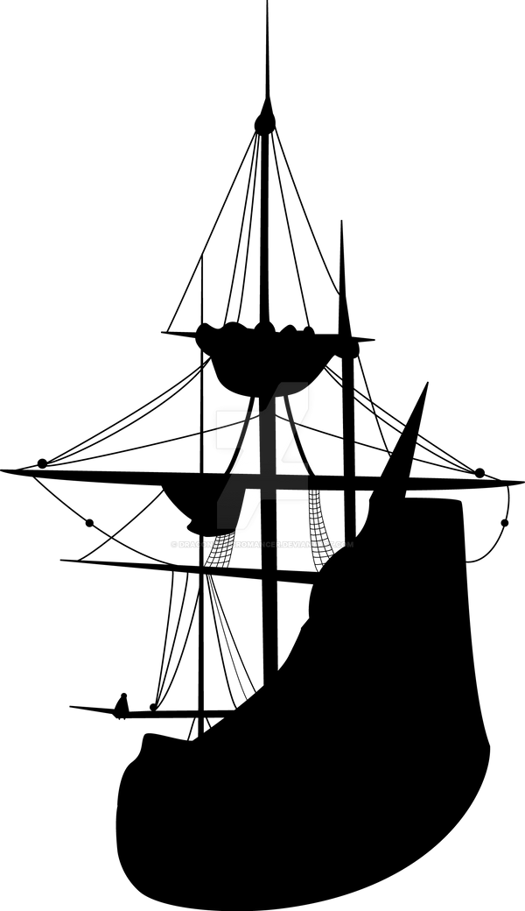

# DSC New Staff Onboarding 

- Pre-workshop activities: 10 min 
- Introductory presentation: 10 min
- Hands-on activities: 50-120 min

## Welcome to the DSC! 

[The Digital Scholarship Commons](https://onlineacademiccommunity.uvic.ca/dsc/){:target="_blank"} is part of the UVic library and is located on the 3rd floor.  Here we:

- Assist faculty, students, and staff in learning digital tools and methodologies to help them pursue their passions and tell their research stories in engaging ways, in a welcoming, equitable, and diverse environment. 
- Encourage interdisciplinary work across campus in order to spark cross-disciplinary conversations. 
- Offer services to help our UVic community become well-versed in digital information fluency through one-on-one training, workshops, digital curriculum development advice, tools, software, and more.

## Learning objectives 

At the end of this workshop, you will be able to:

1. Understand how 3D printing and laser cutting at the DSC works
2. Navigate the DSC web app on the user and admin side
3. Answer frequently asked questions when working at the DSC assistant desk
4. Use Trello to track tasks
 
[NEXT STEP: Pre-Workshop Activities](pre-workshop.html){: .btn .btn-blue }
